# how dungeon-master produces trends that mixpanel can measure

Read this first when changing the simulation engine, authoring a dungeon, or
asking an AI to build a product analytics story. The counting contracts below
retain the published **1.8.2** evidence. **1.8.3** repairs generation-time windows
and endpoint sampling; see its [upgrade guide](../guides/1.8.3-upgrade-guide.md).
You do not need the analytics checkout or a fresh test run to read these contracts.

The core loop is simple: choose a population, generate actual event histories,
apply an intervention, and measure those histories with a specified report.
Every claimed delta needs a numerator, a denominator, a time window, and a
counting rule. A configured multiplier alone does not define the report result.

## start with these facts

- A dungeon emits flat events, profiles, and optional other tables. Hooks change
  those records. Mixpanel sees imported records, never the configuration or hook.
- Funnel attempts, unique people, sessions, event totals, and active days are
  different denominators. Repeated opportunities can make a small per-attempt
  change look like a much smaller unique-user change.
- UTC/default-session contracts have source-derived and live evidence. Every
  project timezone, identity policy, report option, and hook combination is not covered.
- Local verification catches counting and story defects before import. Live
  verification confirms what survived normalization, ingestion, and identity processing.
- Local funnel totals retain `reentry: false`. Use `reentry: true` explicitly
   when comparing repeated histories with Mixpanel general totals.
- 1.8.2 imported **2,603,397 synthetic events**. Accepted sets passed **1,893
  local/live comparisons** and **102 effect checks**. These are correlated
  assertions, not 1,893 independent experiments or a universal coverage percentage.

The evidence and operational guides are indexed in [docs](../README.md).
The full configuration reference is [README](../../README.md); the detailed
hook catalog is [HOOKS](../../HOOKS.md).

## the path from a config to a report

```mermaid
flowchart LR
    Config[Config and declared schema] --> Validate[Normalize and validate]
    Validate --> Population[Profiles, birth dates, segments]
    Population --> Histories[Funnel attempts and ordinary activity]
    Histories --> Hooks[Hooks change records]
    Hooks --> Final[Identity, bounds, sorting, unique insert IDs]
    Final --> Local[Local report verification]
    Final --> Import[Importer normalization and ingestion]
    Import --> Ready[Reconcile counts and identity readiness]
    Ready --> Live[Native Mixpanel query]
    Local --> Compare[Same report, same population, compare]
    Live --> Compare
```

The validator resolves defaults, clamps some controls, and promotes funnel-step
events to strict events unless explicitly opted out. Inspect `result.warnings`
and `result.validatedConfig`, not just the original config. A requested setting
can differ from the resolved one.

The user loop builds lifecycle, activity, and funnel histories. `everything` sees
the user's complete stream before final storage. Final processing can remove
future events, reconcile engine-owned identity, rederive session labels, and
enforce a strict event budget. A helper's return value can therefore exceed the
number of its clones that survive in the final output.

The importer reshapes flat events into Mixpanel records and normalizes reserved
names. For example, `user_id` becomes `$user_id`, `device_id` becomes `$device_id`,
and `source` becomes `$source`. A query for the original name can miss the imported
property. Check the actual serialized fields when a local value disappears live.

## choose the report before the intervention

Write these fields down before coding a hook:

| field | example |
| --- | --- |
| business claim | treatment users activate more often |
| population | users who entered onboarding in the selected window |
| numerator | distinct entrants completing the final step |
| denominator | distinct entrants, including nonconverters |
| segmentation | event property copied from the assigned profile segment |
| report | ordered unique-user funnel, 30-day window |
| statistic | conversion-rate difference in percentage points |
| intervention | target conversion rate versus a neutral equal-rate control |
| acceptance | minimum entrants per arm, practical effect band, each fixed seed |
| operational settings | UTC, identity policy, session settings, query filters |

For TTC, replace entrants with the report's eligible completed histories and name
the statistic. A mean and a median can tell different stories. For retention,
state the birth event, return event, bucket alignment, return mode, and maturity rule.

## parameter-to-report map

| control | what changes in the dataset | report to measure | common trap |
| --- | --- | --- | --- |
| `numUsers`, `numEvents`, rate and day controls | population, finite activity budget, observation window | entrants, active users, total events, eligible cohorts | more events do not necessarily add independent converters |
| `macro`, born percentage and bias | acquisition/activity distribution through the window | daily signups, active users, event trends | cumulative acquisition can overpower a flat activity target |
| `soup`, day/hour weights | timestamp distribution of generated activity | same-DOW daily comparisons, hourly activity | funnel offsets and active-day scheduling modify the final distribution |
| `funnels[].conversionRate` | completion/dropout behavior within offered attempts | unique, total, or session funnel conversion | a configured percent is not a guarantee for every report denominator |
| `conditions` | which profiles are eligible for a particular funnel | conversion by the intended segment | conditional funnels must have the same steps and populated control groups |
| `timeToConvert` | timing offsets within a generated funnel attempt, in hours | native funnel mean TTC for selected histories | another attempt or organic matching event may supply a report step |
| `attempts` | failed priors on born-user first funnels | retries, pre-auth traffic, completion after attempts | repeats do not mean every user gets more independent trials |
| persona conversion/TTC/volume modifiers | behavior across funnels or activity for assigned personas | normalized rates, TTC, events per user | modifiers compose and can saturate at 100% conversion |
| experiment variants | exposure markers and variant-specific behavior | exposure-to-outcome conversion and TTC | filter both exposure and outcome; assignment counts are not effects |
| `retentionCurve` | weighted active-day plans | observed return rates in mature birth cohorts | it is not a literal Bernoulli probability for each return bucket |
| `avgActiveDaysPerUser` | activity-day budget | distinct active days and return curves | decay can erode selected days; retentionCurve takes precedence |
| `engagementDecay` | later activity thinning and possible reactivation | age-aligned engagement/return curves | floors and reactivation knobs lack universal live calibration |
| `worldEvents` | selective amplification/suppression and contextual changes | affected event/segment within the incident window | compare unaffected events and outside-window activity too |
| event/property `__weights`, `autoPowerLaw` | selection distributions | event totals or property shares | organic funnels contribute to totals beyond standalone event weights |
| `stickyEventProps`, contextual values | profile/event correlation | property-based segments | declare the property and use final emitted values, not inferred assignment |
| campaign eligibility and touch caps | which existing events receive campaign fields | attribution with an explicit conversion and lookback | lifetime sampling can place touches after conversion |
| identity/device/session controls | IDs, auth transitions, sticky devices, diagnostic session IDs | uniques, stitched funnels, derived sessions | profile pools and stamped session IDs are not query-time truth |

Use [story recipes](story-recipes.md) for concrete implementation patterns and
[counting contracts](counting-contracts.md) for the precise report semantics.

## what the published evidence establishes

| mechanism | accepted live effect | scope |
| --- | --- | --- |
| segment conditions | 43.1-49.3 percentage-point conversion lift | first-funnel unique conversion, three fixed seeds |
| persona conversion | 26.2-32.0 percentage-point lift | populated target/control segments |
| persona TTC | about 0.25x mean TTC | selected first-funnel completions |
| V2 TTC hook | about 0.25x baseline-adjusted mean TTC | paired before/after histories, competing traffic |
| experiments | 29.4-31.5-point lift; 0.247-0.250x TTC | corrected global fields on exposures, neutral arms |
| persona volume | 2.90-3.12x events per user | normalized by assigned users |
| explicit weights | about 80% common value | ordinary generated traffic and neutral weights |
| incident volume | 2.79-3.15x | affected window, unaffected event control |
| retention curve contrast | 21.7-23.5-point mature D7 lift | weighted scheduling, not literal requested probabilities |
| aggregate hook | exact 2x numeric scaling | predeclared numeric property, populated bins |
| funnel-frequency hook | 52.8-57.2-point lift | full-user-history intervention; no empty-bin conditional skip |
| legacy TTC hook | about 0.5x TTC | first-funnel case only |
| count-scaling hook | exact 2x target volume and matching histograms | time capacity reserved; raw event counts |
| first-touch hook | 100% engineered share among eligible attributed conversions | distinct touch times; neutral share zero |
| session shaping | exact local/live session counts | full stream, explicit dataset bounds, default UTC sessions |
| path injection | 99.0-99.3% visible share; 25.2-29.0-point lift | eligible templates, first flow, specified forward slots |

These are measured operating points, not promised outputs for arbitrary settings.
The sweep separately covered 297 cells: 125 supported and 172 insufficient-evidence.
The largest dungeon in that sweep emitted 281,751 events. Its 17.08 million total
events came from 594 generations, not one large dungeon.

## the failures taught us what to check

**Identities need emitted evidence.** A profile containing two devices used to
invent a local cross-device conversion. Automatic verification now requires valid
both-ID events. The live stitched fixture initially returned zero, then later one
conversion without another import. Its unstitched control remained zero.

**Global properties must reach synthetic events.** Experiment exposure markers
originally omitted the run/scenario fields. A filtered report then lost 9,000
exposures. 1.8.2 includes declared global properties on those markers.

**Count changes need time capacity.** A 2x clone request produced about 1.997x after
future-event clipping. The follow-up reserved room and matched exactly. The guard
remains; the original capacity finding was not erased.

**Equal-time attribution can be ambiguous.** Different source values sharing the
first timestamp produced 26 per-source differences. A distinct-time follow-up
matched. Backend write order is not recoverable from a plain event array.

**A green assertion can count the wrong population.** Summing the same users across
periods used to satisfy `minCohort`. 1.8.2 uses conservative independent-user lower
bounds and applies the guard to custom callbacks. Unknown evidence caps a passing
result at `WEAK`. It does not turn every bespoke assertion into statistical proof.

## safe working rules for humans and AI

1. Read this reference, the report contracts, and the recipe that matches the goal.
2. Reuse existing parameter and helper APIs. Keep public defaults explicit in reports.
3. Define schema before the hook. Event properties are flat: `record.amount`.
4. Use ordinary competing traffic, multiple opportunities, and nonconverters.
   Assert those populations survived validation and generation.
5. Pin a time window, seed, and `concurrency: 1` for reproducible comparisons.
   Ignore only fresh `insert_id` values when testing same-version determinism.
6. Measure the neutral intervention and unaffected controls. Same seed with a
   changed config does not guarantee matched users or matched random draws.
7. Count eligible entrants, converters, or mature return users per segment.
   Small cells are insufficient evidence, not automatically broken effects.
8. Preserve a failed checkpoint. Fix semantics or capacity instead of moving targets
   after observing the result. Explain any deliberately revised fixture condition.
9. For live checks, stamp a declared run property and namespace all identities.
   Reconcile event totals and identity readiness before comparing native reports.
10. Keep local, source-derived, live-query, and rendered-dashboard evidence separate.
    A query response does not prove a saved chart renders in the browser.

## what still needs new work

Non-UTC/DST, project-specific session exclusions, original-merge/B2B identity,
finite-lookback attribution through the current local API, all list-HPC formatting
and cardinality cases, and all Flows pruning modes are not universally equivalent.
Nor are high-density/long-window extremes, every modifier composition, arbitrary
callbacks, or literal retention-curve probability calibration.

Warehouse metrics, standalone cadence streams, SCDs, groups, lookups, mirrors, and
ad spend have separate contracts and tests. Identity-less cadence IDs identify
series, not people. Ordinary background events in a mixed fixture do not prove
the `standaloneEvents` API. A successful user-event import does not deploy a
warehouse source or validate an as-of join.

## code and source map

| concern | owning code | source contract to consult only when extending it |
| --- | --- | --- |
| generation and lifecycle | [user loop](../../lib/orchestrators/user-loop.js), [funnels](../../lib/generators/funnels.js) | generated-history invariants and focused fixtures |
| ordered/any-order funnels, HPC | [funnel engine](../../lib/verify/funnel-engine.js) | analytics `reader/funnels/history.cpp`, `queries/funnel_query.cpp`, `libquery/aggregate.cpp` |
| identity | [identity](../../lib/verify/identity.js) | analytics identity-manager v3 lookup/update and device/user records |
| sessions | [sessionize](../../lib/verify/sessionize.js) | analytics `queries/session_query.cpp` and API session rewrite |
| rolling frequency, aggregates | [counting](../../lib/verify/counting.js) | analytics `queries/addiction_query.cpp`, `queries/normal_query.cpp` |
| retention/attribution dispatch | [report emulator](../../lib/verify/emulate-breakdown.js) | analytics `queries/retention_query.cpp`, `libquery/whoval/read.cpp` |
| paths and grouping | [flows](../../lib/verify/flows.js) | analytics `queries/flows_query.cpp` and prefix-tree merge |
| story verdicts | [story runner](../../lib/verify/story-runner.js) | local acceptance contract; not a Mixpanel report |
| serialization/import | [sender](../../lib/orchestrators/mixpanel-sender.js) | installed importer transforms and emitted wire records |

The source revision used for the study was
`717286d2d3ed03e9e3f9cb4346e4c6b2e561fb9a`. The contracts are summarized here so
normal authoring does not require reading that checkout again. Reopen the relevant
source boundary when supporting a new report mode or diagnosing a genuine mismatch.